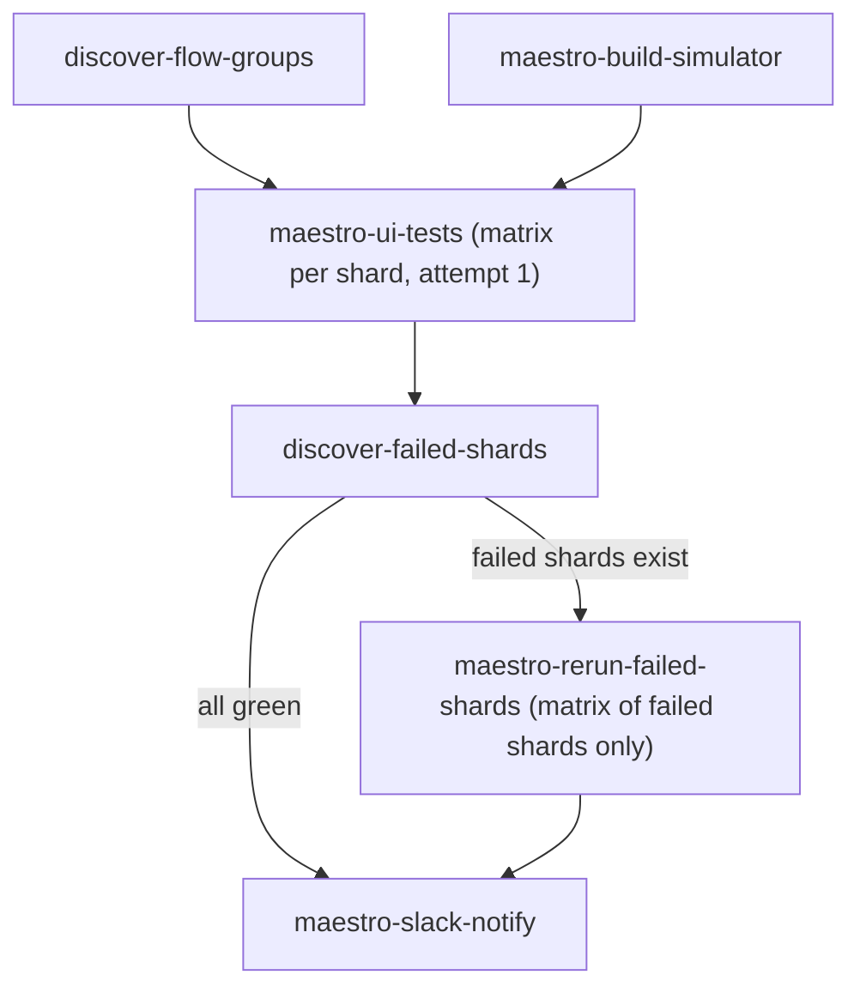

# Slack bot — Maestro autotests status

Posts iOS Maestro UI test results to `#tk-autotests-status` after each CI run.

Workflow job: [.github/workflows/maestro-ui-tests.yml](../../../../.github/workflows/maestro-ui-tests.yml) → `maestro-slack-notify`.

## High-level flow



- `discover-failed-shards` reads each shard's `maestro-failed-state-<shard>` artifact and emits a JSON array of shards whose `failed_paths.txt` is non-empty.
- `maestro-rerun-failed-shards` re-uses the simulator app artifact from the build job and re-runs only those failed flows in a fresh simulator. Results are uploaded under `maestro-ci-rerun-<run_id>-<shard>`.
- `maestro-slack-notify` always runs. It downloads both the first-attempt and auto-rerun artifacts, merges them per shard, and posts a single message + threaded breakdown.

## Message format

**Root message** (always present):
- platform + final pass/fail line
- aggregate `flows: N total | N passed | N failed` reflecting the merged state after auto-rerun
- when the auto-rerun ran: `auto-rerun: <recovered>/<retried> recovered across <N> shard(s)`
- per-shard list (`auto-rerun` marker on shards that went through the rerun job)
- unit-test status: a `*Unit tests:*` header followed by `N tests passed ✅`, or `K / N unit tests failed ❌ (details in thread)` (the per-test breakdown lives in the thread, not the root message). Omitted only when no `maestro-unit-test-results` artifact was downloaded
- link to the workflow run

**Thread replies (failures only)**:
1. One single auto-rerun summary reply when the rerun job ran, listing recovered and still-failing flows (`shard/flow`).
2. One reply per still-failing flow — **a single Slack message** with the failed test name, `Step` / `YAML line` / `Error`, and the failure screenshot attached via `initial_comment` (so text and image stay together; no more out-of-order screenshot replies). Flows are posted in stable `shard` → `flow name` order. Rerun screenshot has priority over the first-attempt one.
3. If a screenshot upload fails for any reason, the text caption is posted first, then a follow-up `_screenshot upload failed: ..._` reply — instead of crashing the loop.
4. One reply per failed unit test with its `error` message(s), parsed from the unit-test `junit.xml`. Capped at 25 replies; the overflow is summarized in a single trailing note.

## Example: partial recovery

Main message:
```
❌ *iOS Maestro UI tests* — 1 failed
flows: 4 total | 3 passed | 1 failed
auto-rerun: 1/2 recovered across 1 shard(s)

*Shards:*
• `battery` ✅ (1/1) — <…|maestro-ci-99-battery>
• `transactions` ❌ (2/3) (auto-rerun) — <…|maestro-ci-99-transactions>

<…|Open workflow run>
```

Thread:
```
🔁 *auto-rerun* — shards: transactions
recovered (1): `transactions/send_ton_max_warning_test`
still failing (1): `transactions/swap_deeplink_usdt_ton`

*Failed test:* `swap_deeplink_usdt_ton` (`transactions`) — _still failing after auto-rerun_
*Step:* `Tap "Swap"`
*YAML line:* `swap_deeplink_usdt_ton.yaml:42`
*Error:* Assertion is false: "Swap" is visible
[swap_deeplink_usdt_ton_failure.png attached to the same message]
```

## Resilience contract

- `SlackClient._execute` retries `429`, `5xx`, `urllib`/`OSError` and Slack-side `ratelimited`/`internal_error`/`fatal_error`/`service_unavailable` with exponential backoff (honours `Retry-After` and `response_metadata.retry_after`). Default: 4 attempts, base 1.5s.
- `SlackClient.upload_file` uses the modern Slack files API (`files.getUploadURLExternal` → upload bytes → `files.completeUploadExternal`). The failure caption is passed as `initial_comment` so the screenshot and error text are one thread message. The legacy `files.upload` endpoint is no longer called; that endpoint is being retired by Slack and used to crash the entire thread fan-out on a single failure.
- The thread fan-out wraps **each report** in `try/except`. A single transient or permanent failure (network, rate limit, file too large, channel access) only affects that one report. On screenshot upload failure the text caption is still posted so context is never lost.
- `SlackClient.try_post_message` is the no-throw helper used in fallback branches.

## Slack App setup

1. [api.slack.com/apps](https://api.slack.com/apps) → **Create New App** → **From scratch**.
   The app must include a **bot user** (created automatically with "From scratch").
2. **OAuth & Permissions** → **Bot Token Scopes**:
   - `chat:write` — post status messages
   - `files:write` — upload failure screenshots in threads (covers both legacy and modern files API)
3. **Install App** → **Install to Workspace**.
4. Copy **Bot User OAuth Token** (`xoxb-...`).
5. In Slack: `/invite @YourBotName` in `#tk-autotests-status`.

### Common install errors

| Error | Fix |
|-------|-----|
| "Add at least one feature or permission scope" | Add `chat:write` under **Bot Token Scopes**, save, reinstall. |
| "Doesn't have a bot user to install" | Recreate app **From scratch**, or add `bot_user` in **App Manifest**. |

## GitHub secrets

| Secret | Required | Description |
|--------|----------|-------------|
| `SLACK_BOT_TOKEN` | yes | Bot token (`xoxb-...`) |
| `SLACK_AUTOTESTS_CHANNEL` | no | Channel ID (`C…`) or name (`tk-autotests-status`). Default: `tk-autotests-status` |

If `SLACK_BOT_TOKEN` is missing, the notify job skips posting with a warning.

## Scripts

| File | Purpose |
|------|---------|
| `parse_maestro_ci_summary.py` | Parse `maestro-ci-summary.txt` produced by Maestro CI artifacts |
| `merge_attempt_summaries.py` | Merge first-attempt + auto-rerun `maestro-ci-summary.txt` files into per-shard final status. The rerun job generates one summary entry per top-level `===== RETRY: <path> (exit N) =====` block, so Slack never reparses the large raw log. A first-attempt failure that the shard's own retry recovered (`maestro-ci-summary-retry.txt`) never reaches the auto-rerun, so it is cleared here rather than read as still failing. |
| `github_artifacts.py` | Resolve Maestro CI artifact download URLs from a workflow run |
| `post_maestro_slack_status.py` | Build Slack message and post to channel + failure threads |

## Local dry-run

```bash
cd maestro_ui_tests/ci/slack_bot

python3 post_maestro_slack_status.py --dry-run \
  --artifacts-dir /path/to/downloaded/maestro-ci-artifacts \
  --run-url "https://github.com/tonkeeper/ios/actions/runs/123" \
  --token dummy
```

The artifacts directory may use either the new layout (`first-attempt/<artifact>/...` and `rerun/<artifact>/...`) or the legacy flat layout. Both are supported by `merge_attempt_summaries.discover_first_summaries`.
